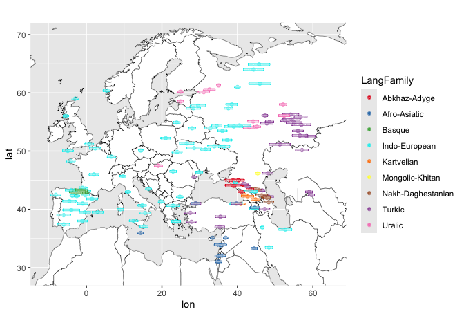
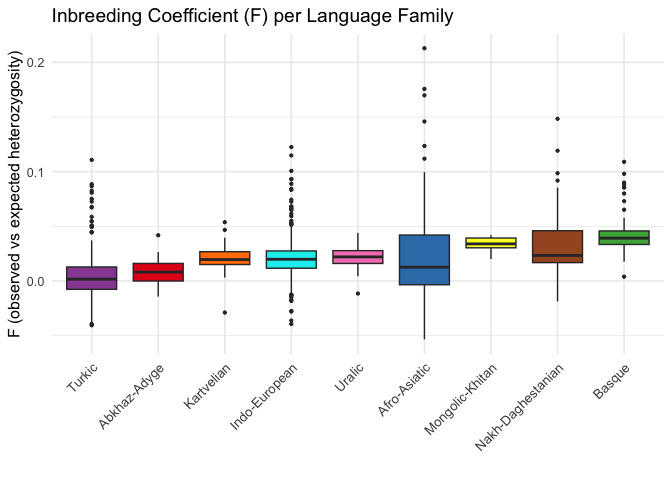
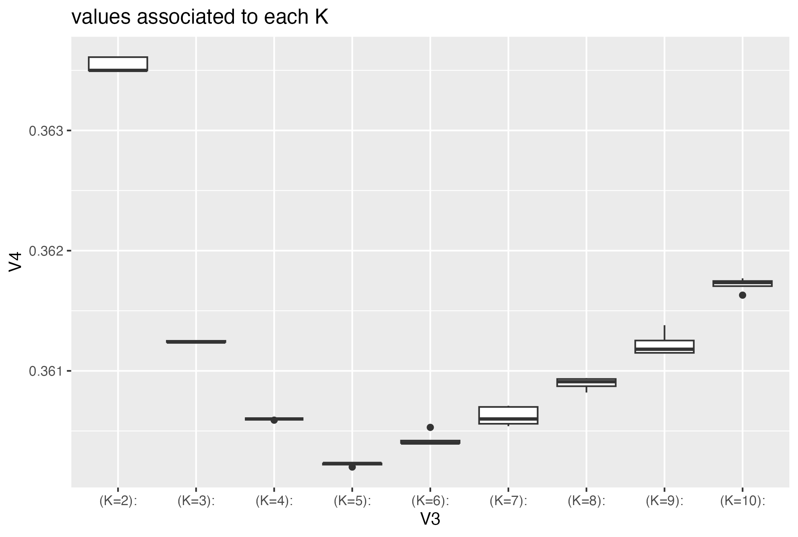

SIBE Workshop - Introduction to Population Genetics
================
Chiara Barbieri
2025-07-10

WORK IN PROGRESS!

# Genetic Structure and Language Diversity in Europe

Population genetics practical: PCA, ADMIXTURE, F<sub>ST</sub>, and
linguistic comparisons

Goals.

- Understand and apply population analysis tools (PCA, ADMIXTURE,
  F<sub>ST</sub>)
- Explore genetic diversity patterns in Europe
- Compare genetic structure with linguistic diversity (focus:
  Indo-European, Uralic, Basque)
- Develop command-line and R skills for population genetics

## Practical set up

For this practical you will be working with:

- The terminal of your computer
- Your local RStudio

In the terminal, download this github folder as

Now open RStudio and run the following command to install the packages
we will need:

``` r
install.packages(c("maps", "ggrepel", "ggplot2", "tidyverse", "ape"), repos="http://cran.us.r-project.org")
```

As a last step, set the working directory in your RStudio pointing to
your computer location where you downloaded the files. (Session –\> Set
Working Directory –\> Choose Directory)

## A dataset of Human Diversity

In this exercise we are going to work with a SNP dataset of different
human populations from Western Eurasia. The purpose of these analysis is
to understand human genetic variation through the lens of population
history and linguistic diversity.

The individuals are genotyped with a SNP chip array designed by for
maximizing information on human diversity and demographic events, named
Human Origins (Affymetrix).

We will using `PLINK`, a software for data manipulation and basic
statistics, and `ADMIXTURE` for reconstructing different ancestry across
individuals.

Our dataset includes 174 populations matched with linguistic identifiers
(curated from the GeLaTo database, <https://gelato.clld.org/>).  
Published data is taken from - [Patterson et
al. 2012](https://reich.hms.harvard.edu/sites/reich.hms.harvard.edu/files/inline-files/2012_Patterson_AncientAdmixture_Genetics.pdf) -
[Lazaridis et
al. 2014](https://reich.hms.harvard.edu/sites/reich.hms.harvard.edu/files/inline-files/2014_Nature_Lazaridis_EuropeThreeAncestries.pdf) -
[Lazaridis et
al. 2016](https://sfera.unife.it/bitstream/11392/2418413/4/nihms-804247.pdf) -
[Jeong et al. 2019](https://pmc.ncbi.nlm.nih.gov/articles/PMC6542712/) -
[Flores-Bello et
al. 2021](https://www.cell.com/current-biology/fulltext/S0960-9822(21)00349-3?_returnURL=https%3A%2F%2Flinkinghub.elsevier.com%2Fretrieve%2Fpii%2FS0960982221003493%3Fshowall%3Dtrue)

Let’s start with some data screening on the database. First we look at
the geographic coverage:

``` r
# import info about our dataset
# this file includes information for each population in the dataset
eurasia_pops <- read.csv("EurasiaInfoPop.csv", header=T, as.is=T)

# import packages for plotting
library("maps")
library("ggrepel")
library("tidyverse")


# a color palette with 9 colors
colorini <- c("#E41A1C", "#377EB8", "#4DAF4A", 
              "cyan2" , "#FF7F00", "#FFFF33", 
               "#A65628", "#984EA3","#F781BF")

# plot map with the origin of our samples
map.world <- map_data(map="world")
gg <- ggplot()
gg <- gg + theme()
gg <- gg + geom_map(data=map.world, 
                    map=map.world, 
                    aes(map_id=region), 
                    fill="white", 
                    colour="black", 
                    size=0.15)
gg <- gg + coord_quickmap(ylim=c(29,70), xlim=c(-11,65))
  
 gg + geom_point(data=eurasia_pops,aes(x=lon, y=lat,color=LangFamily), alpha=0.5) +
   geom_label(data=eurasia_pops,aes(x=lon, y=lat,label =PopName,color=LangFamily), size=0.5, alpha=0.5) +
  geom_label_repel(force = 1)+
   scale_colour_manual(values=colorini)
```

<!-- -->

This map shows the location of each population and the linguistic
affiliation of the language spoken by each population.

------------------------------------------------------------------------

# PLINK

Available at <https://www.cog-genomics.org/plink/1.9/>. To use in your
own computer: download the executable, move it in the same folder with
the exercise material, an open in your terminal as

    ./plink

PLINK is a tool created for genome-wide association studies (GWAS) and
research in population genetics. PLINK parses each command line as a
collection of flags (each of which starts with two dashes), plus
parameters (which immediately follow a flag). Because PLINK was
developed for GWAS medical studies, some basic information in the input
files will be not used in our analysis, such as pedigree or phenotype.

### Different formats for input files

The native PLINK formats consist of tables of where each sample is
associated to a set of variant calls.

The input file formats come in two versions: binary (.bed + .bim + .fam)
and text (.ped + .map). The two (or three) files have to be called with
the same root name and different extension.

The *.ped* includes ID, pedigree(optional) + genotype table.

The *.map* is basically the list of SNPs with chromosome position and
alleles. Its equivalent is the *.bim* file.

*.bed* for binary and *.ped* for text files: Containing the genotype
information. One line per individual.

The *.ped* file contains also information on the individual. In the
binary form this information is available separately in the *.fam* file.
The first six columns of the *.ped* (mandatory), and the *.fam*
therefore look the same:

         Family ID
         Individual ID
         Paternal ID
         Maternal ID
         Sex (1=male; 2=female; other=unknown)
         Phenotype (for association studies)

*.map* for text files: list of markers. Each line of the MAP file
describes a single marker and must contain exactly 4 columns:

         chromosome (1-22, X, Y or 0 if unplaced)
         rs# or snp identifier
         Genetic distance (Centimorgans)
         Base-pair position (bp units)

*.bim* for binary Each line of the MAP file describes a single marker
and must contain exactly 6 columns. It is an extended *.map* file with
two extra columns for allele names.

### From one format to another

The command like of `plink` is

    plink --file yourfile --flag modifiers that makes some action on your file

where *yourfile* is the root name of the two text files .ped and .map.
if you use the flag –bfile, instead, you call the three binary files
.bed, .bin and .fam.

We start with some example: pass from one file format to the other and
look at the differences between them on the terminal.

    plink --bfile EurasiaSelection --recode

Look at what `plink` displays while taking action on your file. How many
individuals are included in our exercise file? Explore the newly
generated files. How many lines has each file? How are the SNP variants
described?

Navigate the online documentation and find which flags you can use to
turn the file into a vcf format.

Other useful tools: subset a list of SNP, subset a list of individuals,
merge two datasets.

## Basic population genetics tools

Generate some simple summary statistics: Diversity within the samples
and between the samples.

``` r
# read the fam file: it is the list of individuals in the specific order for the analysis.

fam<-read.table("EurasiaSelection.fam")

#  assign column names for clarity
colnames(fam) <- c("PopName", "Sample_ID", "Father_ID", "Mother_ID", "Sex", "Phenotype")

# Create an extended info file. Join with eurasia_pops by PopName
fam_annotated <- fam %>%
  left_join(eurasia_pops, by = "PopName")
```

### Homozygosity - inbreeding - consanguinity

Now we run a `plink` command to explore F, the degree of consanguinity,
and eventually delete outliers with a very high F.

*–het* computes observed and expected autosomal homozygous genotype
counts for each sample, and reports F coefficient estimates
(i.e.(\[observed hom. count\] - \[expected count\]) / (\[total
observations\] - \[expected count\])) to *plink.het*.

    plink --bfile EurasiaSelection --het

Visualize the difference in homozygosity within populations.

``` r
# Import file with heterozigosity info
het <- read.table("plink.het", header=T)

# Plot
het <- read.table("plink.het", header=T)
het <- het %>% rename(Sample_ID = IID)

# Join by Sample_ID
fam_annotated <- left_join(fam_annotated, het[, c("Sample_ID", "F")], by = "Sample_ID")

# now the plot, grouping populations by language family
ggplot(fam_annotated, aes(x = reorder(PopName, F, FUN = median), y = F, fill = LangFamily)) +
  geom_boxplot(outlier.size = 0.8) +
  scale_fill_manual(values = colorini) +
  facet_wrap(~ LangFamily, scales = "free_x") +  # Create separate panels per family
  theme_minimal(base_size = 12) +
  theme(axis.text.x = element_text(angle = 90, hjust = 1, size = 2),
        legend.position = "none",
        strip.text = element_text(size = 10, face = "bold")) +
  labs(title = "Inbreeding Coefficient (F) per Population",
       x = "Population",
       y = "F (observed vs expected heterozygosity)")
```

<!-- -->

Visualize the difference in homozygosity within Language Families

``` r
ggplot(fam_annotated, aes(x = reorder(LangFamily, F), y = F, fill = LangFamily)) +
  geom_boxplot(outlier.size = 0.8) +
  scale_fill_manual(values=colorini)+
  theme_minimal(base_size = 12) +
  theme(axis.text.x = element_text(angle = 45, hjust = 1, size = 10),
        legend.position = "none") +
  labs(title = "Inbreeding Coefficient (F) per Language Family",
       x = "",
       y = "F (observed vs expected heterozygosity)",
       fill = "Language Family")
```

<!-- -->

Visualize the difference in homozygosity on a map.

``` r
# Create new column for heterozigosity values in the pop info file                    
eurasia_pops$het <- NA

# Assign mean het value to each population with a loop command
for (i in 1:nrow(eurasia_pops)){
  temp <- het[which(het$FID == eurasia_pops$PopName[i]),]
  eurasia_pops$het[i] <- mean(temp$F)
}

# Plot het values to map
gg + geom_point(data=eurasia_pops,aes(x=lon, y=lat,color=het), alpha=0.5) +
scale_color_gradient(low = "blue", 
                          high = "red") +
     ggtitle("Intensity of homozygosity in each population")
```

<!-- -->

------------------------------------------------------------------------

## PCA

With the modifier *–pca*. PLINK extracts the top 20 principal components
of the variance-standardized relationship matrix. The results consist in
a *.eigenvec* file with the coordinates for each individual in rows and
eigenvectors in columns, and a *.eigenval* which explains how much
variance there is in the data for that given vector.

``` r
# Import files with eigenvectors & eigenvalues
eigenvec <- read.table("plink.eigenvec")
eigenval <- read.table("plink.eigenval")

pcaR_coord<-cbind(eigenvec, fam_annotated)

#ggplot 1v2
ggplot(pcaR_coord, #dataset to plot
           aes(x = V3, #x-axis is PC1
               y = V4, #y-axis is PC2
               color = LangFamily)) +   #
  geom_point( alpha=0.5) + #default scatter plot 
  geom_text(aes(label=Sample_ID), size=0.6)+
  scale_colour_manual(values=colorini)+
  theme_light() +
   labs(x = eigenval[1,],
             y = eigenval[2,],
             title = "PCA analysis dimension 1 vs. 2")
```

<!-- -->

<!-- -->

How are the language families distributed across the genetic diversity
of Eurasia?

------------------------------------------------------------------------

# Population Distances: F<sub>ST</sub>

Now that we learned some basic commands of popgen with `plink`, we are
shifting to R for other population genetic comparisons with available
dedicated packages. We are using the package TidyPopgen developed in the
lab of Andrea Manica in Cambridge.
<https://evolecolgroup.github.io/tidypopgen/>

In particular, we are taking advantage of its function to calculate
F<sub>ST</sub> distances between populations - this function is not
available in `plink`.

First, we import our file from plink format into an object of type
gen_tibble, a subclass of tibble containing the columns id and genotypes
for each individual. From the .bed file, the information in the FID
column is treated as population information and is automatically added
to the gen_tibble as column “population”.

    library(tidypopgen)
    library(tidyverse)
    library(adegenet)


    genos <- gen_tibble(
      x = "/Users/chiarabarbieri/Documents/WorkshopSIBE/EurasiaSelection.bed",  # prefix of your .bed/.bim/.fam files
      quiet = TRUE             # optional: suppress progress messages
    )
    # This will calculate the Weir & Cockerham FST values for all pairwise population comparisons.

    grouped_genos <- genos %>% group_by(population)
    pairwise_fsts <- grouped_genos %>% pairwise_pop_fst(
      type = "pairwise"
    )

It takes a few minutes to calculate all the pairwise population
distances. The result is stored in a matrix of size Number of
Populations x Number of Populations.

``` r
pairwise_fsts <- read.table("pairwise_fsts.txt", sep="\t", header=T, row.names=1)
pairwise_fsts<-as.matrix(pairwise_fsts)
```

How to display population distances? We can use a tree visualization,
keeping in mind that this does not correspond to actual population
evolutionary and demographic pathway, but just as a graphic
representation of relative distances. We can use a Neighbor-Joining tree
display as implemented in the package ‘ape’.

``` r
library(ape)

fst_tree <- nj(pairwise_fsts) 
fst_tree$edge.length[fst_tree$edge.length < 0] = 0.002
tip_meta <- eurasia_pops[match(fst_tree$tip.label, eurasia_pops$PopName), ]

library(ggtree)
library(ggplot2)
tree <- ggtree(fst_tree) %<+% tip_meta +
  geom_tippoint(aes(color = LangFamily), size = 1) +
  geom_tiplab(size = 1, hjust = -0.1) +  # adjust size and position as needed
  scale_color_manual(values = colorini) +
  theme_tree2() +
  ggtitle("Neighbor-Joining Tree of Pairwise FST") +
  theme(legend.position = "right")
tree
```

<!-- -->

You can plot the tree with different layout, for example adding layout =
“circular” or layout = “unrooted” inside the ggtree specification.

How do language families distribute across the single population
branches? Can we spot possible cases of language shift?

------------------------------------------------------------------------

## Gene-language tree comparisons

PLACEHOLDER FOR A SECTION WHERE WE COMPARE THE GENETIC TREE AGAINST THE
LINGUISTIC TREE OF INDO-EUROPEAN, TAKEN FROM
<https://www.science.org/doi/10.1126/science.abg0818>

------------------------------------------------------------------------

# ADMIXTURE analysis WORK IN PROGRESS

Identifying ancestry components shared between individuals of a set of
populations.

ADMIXTURE is a software that works similarly to Structure, but with
faster computation time. Download
<http://dalexander.github.io/admixture/download.html> and manual
<http://dalexander.github.io/admixture/admixture-manual.pdf>.

It takes `plink` format input files.

BEWARE: it does not run on Windows.

### Install admixture in a Mac

Go to the folder where the software was downloaded, open the .zip file.
In the terminal, move in the folder where the software “admixture” is.
Then type

    sudo cp admixture /usr/local/bin/

To move the software in the bin folder of the computer, where it can be
used by typing “admixture” in the terminal.

OR: To use in your own computer: download the executable, move it in the
same folder with the exercise material, an open in your terminal as

    ./admixture

### Use ADMIXTURE in the lab computers

TO BE CHECKED WITH THE TEAM

Open the Ubuntu application and you will see the terminal interface.
Type

    cd ..

Use `cd` to change directory and `ls` to see what is inside the
directory. Navigate to the folder where Admixture software is.

Run admixture as

    ./admixture

### Pruning

First, we prune the dataset for excluding the SNPs in Linkage, with
Plink. The resulting file will have less SNPs, and the computation will
be faster.

The settings define window size, step and the r2 threshold. It is a
setting compatible with the density of SNPs on the human genome
according to the SNP chip array we are considering.

    plink --bfile EurasiaSelection --indep-pairwise 200 25 0.4 --out x.tmp
    plink --bfile EurasiaSelection --extract x.tmp.prune.in --recode12 --out EurasiaSelection_pruned

How many SNPs are left after pruning?

Move these resulting pruned files in the Ubuntu partition, where the
Admixture software is.

### ADMIXTURE run

Now the proper ADMIXTURE run. The following commands will run ADMIXTURE
for each *K* (number of ancestry blocks) desired. One value of *K* will
be more supported by the analysis: the one with the lowest associated
cross-validation error. This *K* will be considered as the best
representation of the actual data variation.

Copy-paste the commands below in a file called `admixture_script.sh` Or
run it directly in the terminal

    typeset -i run=0
    for K in 2 3 4 5; do  # select a meaningful series of K - the more Ks, the longer the run obviously
    ./admixture -s time --cv EurasiaSelection_pruned.ped $K -j2 | tee log.K${K}.RUN1.out;
    mv EurasiaSelection_pruned.$K.P K$K.Run1.P;
    mv EurasiaSelection_pruned.$K.Q K$K.Run1.Q;
    done

Once your file is ready, run the following:

    sh admixture_script.sh

For each run there are three output: .out, .P, and .Q

Now we will elaborate the outputs with a mix of bash commands and *R*.

(But before, move the results file in your Windows partition again!)

### Cross-validation error to identify the best value of *K*

    grep -h CV log*out > CV.txt

plot the distribution of values associated to each K in R.

    # Import cross-validation values
    cv <- read.table("CV.txt")

    # set the smallest and the largest K that you ran
    minK <- 2
    maxK <- 5

    # create vector with values for the x-axis of our plot
    ordine <- c()
    for (k in minK:maxK){
      ordine[k] <- paste("(K=", k,"):", sep = "", collapse = "")
    }

    ordine <- ordine[!is.na(ordine)]

    # load plotting library
    library(ggplot2)

    # plot cross-validation results

    p <- ggplot(cv, aes(x = V3, y = V4)) + 
           geom_boxplot() + 
           ggtitle("values associated to each K") +
           scale_x_discrete(limits = ordine)
      
    p

I previously run 5 iterations for each K and determined which of the 5
runs has the highest likelihood. This is to exclude the chance that some
run did not perform correctly. I also performed runs from K=2 to K=10.



------------------------------------------------------------------------

### Plotting the ADMIXTURE results for each K

prepare to plot: information to plot on the admixture bars, from your
external info population file

    # Import admixture info file
    MYINFO <- read.table("infoAdmixtureExercis.txt", header = T, as.is = T)


    pops <- table(MYINFO$population)
    namespop <- unique(MYINFO$population)

    # plotting pop labels instead of sample ids
    my.labels <- vector()
    for (k in 1:length(namespop)){
      a <- paste("^", namespop[k], "$", sep = "")
      my.labels[k] <- length(grep(a, MYINFO$population))
    }

    # where to plot pop labels
    labels.coords <- vector() 
    labels.coords[1] <- my.labels[1]/2
    for (i in 1:(length(my.labels) - 1)) {
      labels.coords[i+1] <- labels.coords[i] + (my.labels[i] / 2 + my.labels[i+1] / 2)
    }
    z <- vector()
    z[1] <- my.labels[1]
    for (i in 1:(length(my.labels) - 1)){
      z[i+1] <- z[i] + my.labels[i+1]
    }

    # select a color palette
    # you can use colorbrewer
    # put together a number of colours equal Kmax in the following variable

    maxK <- 5

    library(RColorBrewer)
    qual_col_pals <- brewer.pal.info[brewer.pal.info$category == 'qual',]
    col_vector <- unlist(mapply(brewer.pal, qual_col_pals$maxcolors, rownames(qual_col_pals)))
    colorchoice <- sample(col_vector, maxK)

    # now plot for each K
    K <- 2 # chose the K to plot. Start with the lowest.

    valuesToplot <- read.table(paste("K",K,".Run1.Q", sep = "", collapse = ""))

    valuesToplotSort <- valuesToplot[MYINFO$oderAdmix,]

    #To output the plot as pdf, uncomment the next line and the last one
    #pdf(paste("AdmixtureForK",K,".pdf", sep = "", collapse = ""), pointsize=8, height=3.5)

    barplot(t(as.matrix(valuesToplotSort)), 
            col=colorchoice[1:K], 
            axisnames=F, 
            axes=F, 
            space=0,
            border=NA)
    axis(3, 
         labels = FALSE, 
         tick=F)
    for (i in c(0,z)){
      lines(x = c(i,i), y = c(0,3), lwd = 0.7, col =  "white")
    }
    text(labels.coords, 
         par("usr")[3] + 1.03 , 
         srt = 45, 
         adj = 0, 
         labels = namespop, 
         cex=0.7, 
         xpd = TRUE)
    #dev.off()


Look at patterns across populations. Do they follow a geographic
structure? Is there a sign of Admixture?
