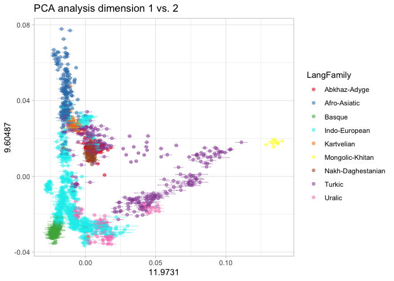
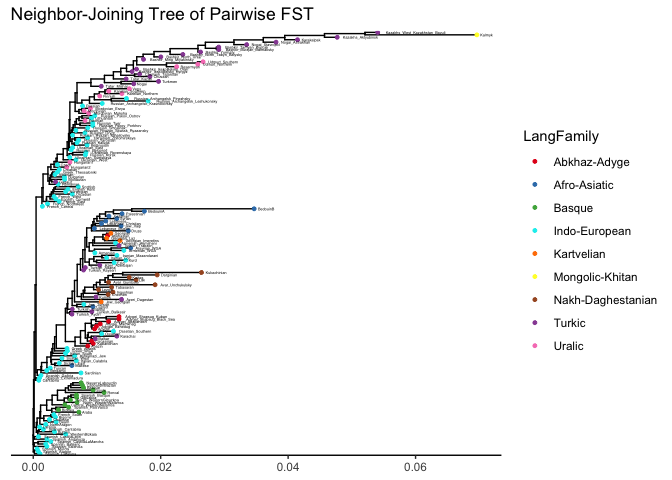
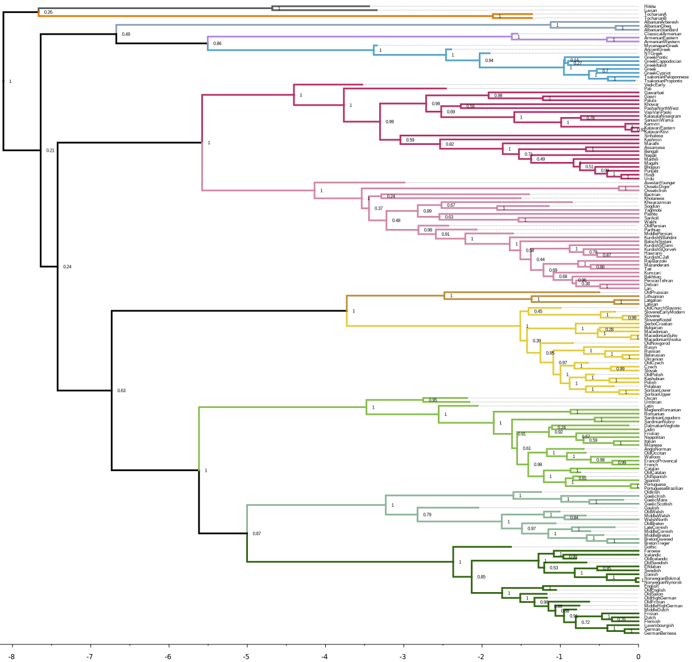

# SIBE Workshop - Introduction to Population Genetics

**Chiara Barbieri**

# Genetic Structure and Language Diversity in Europe

Population genetics practical: PCA, FST, ADMIXTURE, and
linguistic comparisons

Goals:

-   Understand and apply population analysis tools (PCA, FST,
    ADMIXTURE)
-   Explore genetic diversity patterns in Europe
-   Compare genetic structure with linguistic diversity (focus:
    Indo-European)
-   Develop command-line and R skills for population genetics

## Practical set up

For this practical you will be working with:

-   The terminal of your computer
-   Your local RStudio
-   A internet browser

In the terminal, download this github folder as ….

***Teresa: please install*** the packages we will need:

    install.packages(c("maps", "ggrepel", "ggplot2", "tidyverse", "ape", "readr", "tidypopgen", "ggtree", "phytools", "reshape", "scatterpie"), repos="http://cran.us.r-project.org")

Set the working directory in your RStudio pointing to your computer
location where you downloaded the files. (Session –&gt; Set Working
Directory –&gt; Choose Directory)

## A dataset of Human Diversity

In this exercise we are going to work with a SNP dataset comprising
different human populations from Western Eurasia. The purpose of these
analyses is to understand human genetic variation through the lens of
population history and linguistic diversity.

The individuals are genotyped with a SNP chip array designed by for
maximizing information on human diversity and demographic events, named
Human Origins (Affymetrix).

We will using `PLINK`, a software for data manipulation and basic
statistics, some R scripts and dedicated packages for population genetic
analysis, and `ADMIXTURE` for reconstructing different ancestry across
individuals.

Our dataset includes 173 populations matched with linguistic identifiers
(curated from the GeLaTo database, <https://gelato.clld.org/>).  
Published data is taken from - [Patterson et
al. 2012](https://reich.hms.harvard.edu/sites/reich.hms.harvard.edu/files/inline-files/2012_Patterson_AncientAdmixture_Genetics.pdf). -
[Lazaridis et
al. 2014](https://reich.hms.harvard.edu/sites/reich.hms.harvard.edu/files/inline-files/2014_Nature_Lazaridis_EuropeThreeAncestries.pdf). -
[Lazaridis et
al. 2016](https://sfera.unife.it/bitstream/11392/2418413/4/nihms-804247.pdf). -
[Jeong et
al. 2019](https://pmc.ncbi.nlm.nih.gov/articles/PMC6542712/). -
[Flores-Bello et
al. 2021](https://www.cell.com/current-biology/fulltext/S0960-9822(21)00349-3?_returnURL=https%3A%2F%2Flinkinghub.elsevier.com%2Fretrieve%2Fpii%2FS0960982221003493%3Fshowall%3Dtrue).

For this exercise, we are considering a multidisciplinary perspective,
and use genetics to explore the following questions related to
linguistics:

1.  Is the genetic diversity of European population corresponding to the
    distribution of different language families?

2.  Can we identify cases of language shift?

3.  Are linguistic isolates (e.g. Basque) spoken by genetically isolated
    people?

4.  The history of human populations corresponds to the history of the
    languages they speak - inside language families?

------------------------------------------------------------------------

Let’s start with some data screening on the database. First we look at
the geographic coverage:

    # import packages for plotting and data handling
    library("maps")
    library("ggrepel")
    library("tidyverse")
    library("readr")

    # import info about our dataset
    # this file includes information for each population in the dataset
    eurasia_pops <- read_csv("EurasiaInfoPop.csv")

    # a color palette with 9 colors, for 9 Language Families
    colorini <- c("#E41A1C", "#377EB8", "#4DAF4A", 
                  "cyan2" , "#FF7F00", "#FFFF33", 
                   "#A65628", "#984EA3","#F781BF")

    # plot map with the geographic origin of our samples
    map.world <- map_data(map="world")
    gg <- ggplot()
    gg <- gg + theme()
    gg <- gg + geom_map(data=map.world, 
                        map=map.world, 
                        aes(map_id=region), 
                        fill="white", 
                        colour="black", 
                        size=0.15)
    gg <- gg + coord_quickmap(ylim=c(29,70), xlim=c(-11,65)) # cut the coordinates to make a zoom in map of the world
      
     gg + geom_point(data=eurasia_pops,aes(x=lon, y=lat,color=LangFamily), alpha=0.5) +
       geom_label(data=eurasia_pops,aes(x=lon, y=lat,label =PopName,color=LangFamily), size=0.5, alpha=0.5) +
      geom_label_repel(force = 1)+
       scale_colour_manual(values=colorini) # manual assign colors

This map shows the location of each population and the linguistic
affiliation of the language spoken by each population.

------------------------------------------------------------------------

# PLINK

Available at <https://www.cog-genomics.org/plink/1.9/>. You can use it
by calling the command in your terminal as

    plink

PLINK is a tool created for genome-wide association studies (GWAS) and
research in population genetics. PLINK parses each command line as a
collection of flags (each of which starts with two dashes), plus
parameters (which immediately follow a flag). Because PLINK was
developed for GWAS medical studies, some basic information in the input
files will be not used in our analysis, such as pedigree or phenotype.

### Different formats for input files

The native PLINK formats consist of tables of where each sample is
associated to a set of variant calls.

The input file formats come in two versions: binary (.bed + .bim + .fam)
and text (.ped + .map). The two (or three) files have to be called with
the same root name and different extension.

The *.ped* includes ID, pedigree(optional) + genotype table.

The *.map* is basically the list of SNPs with chromosome position and
alleles. Its equivalent is the *.bim* file.

*.bed* for binary and *.ped* for text files: Containing the genotype
information. One line per individual.

The *.ped* file contains also information on the individual. In the
binary form this information is available separately in the *.fam* file.
The first six columns of the *.ped* (mandatory), and the *.fam*
therefore look the same:

         Family ID
         Individual ID
         Paternal ID
         Maternal ID
         Sex (1=male; 2=female; other=unknown)
         Phenotype (for association studies)

*.map* for text files: list of markers. Each line of the MAP file
describes a single marker and must contain exactly 4 columns:

         chromosome (1-22, X, Y or 0 if unplaced)
         rs# or snp identifier
         Genetic distance (Centimorgans)
         Base-pair position (bp units)

*.bim* for binary Each line of the MAP file describes a single marker
and must contain exactly 6 columns. It is an extended *.map* file with
two extra columns for allele names.

### From one format to another

The command line of `plink` is

    plink --file yourfile --flag modifiers that makes some action on your file

where *yourfile* is the root name of the two text files .ped and .map.
if you use the flag *–bfile*, instead, you call the three binary files
.bed, .bin and .fam.

We start with some example: pass from one file format to the other and
look at the differences between them on the terminal.

    plink --bfile EurasiaSelection --recode

Look at what `plink` displays while taking action on your file. How many
individuals are included in our exercise file? Explore the newly
generated files. How many lines has each file? How are the SNP variants
described?

Navigate the online documentation and find which flags you can use to
turn the file into a vcf format.

Other useful tools: subset a list of SNP, subset a list of individuals,
merge two datasets.

## Basic population genetics tools

Generate some simple summary statistics: Diversity within the samples
and between the samples.

    # read the fam file: it is the list of individuals in the specific order for the analysis.

    fam<-read.table("EurasiaSelection.fam")

    #  assign column names for clarity
    colnames(fam) <- c("PopName", "Sample_ID", "Father_ID", "Mother_ID", "Sex", "Phenotype")

    # Create an extended info file. Join with the info file eurasia_pops by PopName
    fam_annotated <- fam %>%
      left_join(eurasia_pops, by = "PopName")

### Homozygosity - inbreeding - consanguinity

Now we run a `plink` command to explore F, the degree of consanguinity,
and eventually delete outliers with a very high F.

*–het* computes observed and expected autosomal homozygous genotype
counts for each sample, and reports F coefficient estimates
(i.e.(\[observed hom. count\] - \[expected count\]) / (\[total
observations\] - \[expected count\])) to *plink.het*.

    plink --bfile EurasiaSelection --het

Visualize the difference in homozygosity between language families.

    # Import file with heterozigosity info
    het <- read.table("plink.het", header=T)

    # Plot
    het <- read.table("plink.het", header=T)
    het <- het %>%  dplyr::rename(Sample_ID = IID)

    # Join by Sample_ID
    fam_annotated <- left_join(fam_annotated, het[, c("Sample_ID", "F")], by = "Sample_ID")

    ggplot(fam_annotated, aes(x = reorder(LangFamily, F), y = F, fill = LangFamily)) +
      geom_boxplot(outlier.size = 0.8) +
      scale_fill_manual(values=colorini)+
      theme_minimal(base_size = 12) +
      theme(axis.text.x = element_text(angle = 45, hjust = 1, size = 10),
            legend.position = "none") +
      labs(title = "Inbreeding Coefficient (F) per Language Family",
           x = "",
           y = "F (observed vs expected heterozygosity)",
           fill = "Language Family")

Visualize the difference in homozygosity on a map.

    # Create new column for heterozigosity values in the pop info file                    
    eurasia_pops$het <- NA

    # Assign mean het value to each population with a loop command
    for (i in 1:nrow(eurasia_pops)){
      temp <- het[which(het$FID == eurasia_pops$PopName[i]),]
      eurasia_pops$het[i] <- mean(temp$F)
    }

    # Plot het values to map
    gg + geom_point(data=eurasia_pops,aes(x=lon, y=lat,color=het), alpha=0.5) +
    scale_color_gradient(low = "blue", 
                              high = "red") +
         ggtitle("Intensity of homozygosity in each population")

------------------------------------------------------------------------

## PCA

With the modifier *–pca*. `plink` extracts the top 20 principal
components of the variance-standardized relationship matrix. The results
consist in a *.eigenvec* file with the coordinates for each individual
in rows and eigenvectors in columns, and a *.eigenval* which explains
how much variance there is in the data for that given vector.

Can you run the PCA command in `plink`, and guess the command by
yourself? Once you run the PCA, we can plot it in R.

    # Import files with eigenvectors & eigenvalues
    eigenvec <- read.table("plink.eigenvec")
    eigenval <- read.table("plink.eigenval")

    pcaR_coord<-cbind(eigenvec, fam_annotated) # make a new file with the PCA coordinates and the information from fam_annotated

    #ggplot 1v2
    ggplot(pcaR_coord, #dataset to plot
               aes(x = V3, #x-axis is PC1
                   y = V4, #y-axis is PC2
                   color = LangFamily)) +   #
      geom_point( alpha=0.5) + #default scatter plot 
      geom_text(aes(label=PopName), size=0.6)+
      scale_colour_manual(values=colorini)+
      theme_light() +
       labs(x = eigenval[1,],
                 y = eigenval[2,],
                 title = "PCA analysis dimension 1 vs. 2")

How are the language families distributed across the genetic diversity
of Eurasia? Can you plot Dimension 1 against Dimension 3 - PC1 vs PC3?

------------------------------------------------------------------------

# Population Distances: FST

Now that we learned some basic commands of popgen with `plink`, we are
shifting to R for other population genetic comparisons with available
dedicated packages. We are using the package TidyPopgen developed in the
lab of Andrea Manica in Cambridge.
<https://evolecolgroup.github.io/tidypopgen/>

In particular, we are taking advantage of its function to calculate
FST distances between populations - this function is not
available conveniently in `plink`.

First, we import our file from plink format into an object of type
gen\_tibble, a subclass of tibble containing the columns id and
genotypes for each individual. From the .bed file, the information in
the FID column is treated as population information and is automatically
added to the gen\_tibble as column “population”.

    library(tidypopgen)
    library(tidyverse)
    library(adegenet)

    genos <- gen_tibble(
      x = "/Users/chiarabarbieri/Documents/WorkshopSIBE/EurasiaSelection.bed",  # prefix of your .bed/.bim/.fam files
      quiet = TRUE             # optional: suppress progress messages
    )
    # This will calculate the Weir & Cockerham FST values for all pairwise population comparisons.

    grouped_genos <- genos %>% group_by(population)
    pairwise_fsts <- grouped_genos %>% pairwise_pop_fst(
      type = "pairwise"
    )

It takes a few minutes to calculate all the pairwise population
distances. The result is stored in a matrix of size Number of
Populations x Number of Populations. I already generated the Fst
distance matrix, which is stored in your files.

    pairwise_fsts <- read.table("pairwise_fsts1.txt", sep="\t", header=T, row.names=1)
    pairwise_fsts<-as.matrix(pairwise_fsts)

How to display population distances? We can use a tree visualization,
keeping in mind that this does not correspond to actual population
evolutionary and demographic pathway, but just as a graphic
representation of relative distances. We can use a Neighbor-Joining tree
display as implemented in the package ‘ape’.

    library(ape)

    fst_tree <- nj(pairwise_fsts) 
    fst_tree$edge.length[fst_tree$edge.length < 0] = 0.002 # manual correction for negative branches in the nj tree
    tip_meta <- eurasia_pops[match(fst_tree$tip.label, eurasia_pops$PopName), ]

    library(ggtree)
    tree <- ggtree(fst_tree) %<+% tip_meta +
      geom_tippoint(aes(color = LangFamily), size = 1) +
      geom_tiplab(size = 1, hjust = -0.1) +  # adjust size and position as needed
      scale_color_manual(values = colorini) +
      theme_tree2() +
      ggtitle("Neighbor-Joining Tree of Pairwise FST") +
      theme(legend.position = "right")
    tree

You can plot the tree with different layout, for example adding layout =
“circular” or layout = “unrooted” inside the ggtree specification.

How do language families distribute across the single population
branches? Can we spot possible cases of language shift?

------------------------------------------------------------------------

## Gene-language tree comparisons

Quantitative linguistic studies are providing several ways to analyse
linguistic diversity. Linguists represent the relationship between
languages inside language families with a tree structure, which is based
on sound resemblance and, in particular, on the distribution of cognates
(words with the same meaning and similar etymological origin). By
excluding (or minimizing) instances of horizontal contact (word
borrowing), linguists can reconstruct the history of languages with word
lists of cognates which are fed in computational Bayesian phylogenetic
methods. In this paper (\[Heggarty et
al. 2023\]<https://www.science.org/doi/10.1126/science.abg0818>) the
authors used a dataset of 109 modern and 52 time-calibrated historical
Indo-European languages (extinct ancient languages). Here is a
simplified tree showing their result: a time-calibrated history of the
Indo-European language family.

<!-- -->

We are using their linguistic distances and compare them to our genetic
distances, for a subset of population/languages that overlap between the
two, to reproduce the iconic comparisons first published by
Cavalli-Sforza and colleagues in 1988.
<https://pubmed.ncbi.nlm.nih.gov/3166138/>

<!-- -->

First we subset the genetic distances:

    library("reshape")

    # the subset of populations for which we have linguistic data, in the Indo-European language family
    listpopLang<-eurasia_pops$PopName[which(eurasia_pops$proxyHeggartyTree!=0)]

    listAUS<-unique(eurasia_pops$proxyHeggartyTree) 
    listAUS<-listAUS[-which(listAUS=="0")] # the glottocodes

    listAUSname<-unique(eurasia_pops$LangNameHeggartyTree)
    listAUSname<-listAUSname[-which(listAUSname=="0")] # the language names in the language tree

    pairwise_fsts_subset <- pairwise_fsts[listpopLang, listpopLang]
    # the same matrix, but in "melt" form
    meltFstRED<-melt(pairwise_fsts_subset,varnames=c('Pop1', 'Pop2'))
    colnames(meltFstRED)[3]<-"Fst"

    # associate the glottocode so i can match with the genetic data
    meltFstRED <- meltFstRED %>%
      left_join(
        eurasia_pops %>% select(PopName, proxyHeggartyTree) %>%
          dplyr::rename(Pop1 = PopName, glottocodeBase11 = proxyHeggartyTree),
        by = "Pop1"
      ) %>%
      left_join(
        eurasia_pops %>% select(PopName, proxyHeggartyTree) %>%
          dplyr::rename(Pop2 = PopName, glottocodeBase22 = proxyHeggartyTree),
        by = "Pop2"
      )

    #Create a standardized key for the glottocode pairs
    meltFstRED <- meltFstRED %>%
      mutate(
        glottocodeBase11 = as.character(glottocodeBase11),
        glottocodeBase22 = as.character(glottocodeBase22),
        LangPair = paste0(pmin(glottocodeBase11, glottocodeBase22), "_", pmax(glottocodeBase11, glottocodeBase22))
      )

Second, we extract the linguistic distances from the Bayesian
phylogenetic tree:

    AUS<-read.nexus("IECoR_Main_M3_Binary_Covarion_Rates_By_Mg_Bin_mcc.tree")

     # select only the tips i have, from linguistic tree.
    alberoLang <- keep.tip(AUS, listAUSname)

    distancealberoLang<-cophenetic.phylo(alberoLang) # 
    distancealberoLang<-distancealberoLang/2*1000 # remember the distances are double!!
    # the same distances, but in "melt" format
    MELTdistancealberoLang<-melt(distancealberoLang,varnames=c('Lang1', 'Lang2'))
    colnames(MELTdistancealberoLang)[3]<-"Langdist"
    # associate the glottocode so i can match with the genetic data
    MELTdistancealberoLang <- MELTdistancealberoLang %>%
      left_join(
        eurasia_pops %>% select(LangNameHeggartyTree, proxyHeggartyTree) %>%
          dplyr::rename(Lang1 = LangNameHeggartyTree, glottocodeBase11 = proxyHeggartyTree),
        by = "Lang1"
      ) %>%
      left_join(
        eurasia_pops %>% select(LangNameHeggartyTree, proxyHeggartyTree) %>%
          dplyr::rename(Lang2 = LangNameHeggartyTree, glottocodeBase22 = proxyHeggartyTree),
        by = "Lang2"
      )
    MELTdistancealberoLang <- MELTdistancealberoLang %>%
      mutate(
        glottocodeBase11 = as.character(glottocodeBase11),
        glottocodeBase22 = as.character(glottocodeBase22),
        LangPair = paste0(pmin(glottocodeBase11, glottocodeBase22), "_", pmax(glottocodeBase11, glottocodeBase22))
      )

Now, we merge the linguistic distances on the genetic distances. We have
more populations speaking the same language: the linguistic distances
will be repeated for all the populations that speak the same language.

    merged_table <- meltFstRED %>%
      left_join(
        MELTdistancealberoLang %>%
          select(LangPair, Langdist), 
        by = "LangPair",
        relationship = "many-to-many"
      )

    merged_table <- merged_table %>%
      distinct()  # delete duplicated rows

    # make the language time matrix with the populations present in gelato

    timetreelangMatrix<-matrix(NA, length(listpopLang),length(listpopLang))
    rownames(timetreelangMatrix)<-listpopLang
    colnames(timetreelangMatrix)<-listpopLang

    for (i in 1:nrow(timetreelangMatrix)){
      for (j in 1:ncol(timetreelangMatrix)){
        temp<-which(merged_table$Pop1==rownames(pairwise_fsts_subset)[i]&merged_table$Pop2==colnames(pairwise_fsts_subset)[j])[1]
        if(length(temp)>0){
          timetreelangMatrix[i,j]<-as.numeric(merged_table$Langdist[temp])
        }
      }
    }

And finally, we make the tree comparison, with the genetic tree on the
left and the linguistic tree on the right:

    # now, trees

    phy1 <- nj(pairwise_fsts_subset)
    phy2 <- nj(timetreelangMatrix)
    ## root with Albanian as outgroup, according to the linguistic tree IE
    rootalo<-c("Albanian")
    phy1 <- root(phy1, rootalo)
    phy2 <- root(phy2, rootalo)
    phy1$edge.length[phy1$edge.length < 0] = 0.002 # manually correct negative branches

    ### compare phylogenies with Phytools
    library("phytools")
    plot(cophylo(phy1,phy2,rotate=T), fsize=0.6)

    ## Rotating nodes to optimize matching...
    ## Done.

Spot the major differences between the two structures. This comparison
can be used to identify language shifts or mismatches in the linguistic
and genetic structure of Indo-European.

------------------------------------------------------------------------

# ADMIXTURE analysis

ADMIXTURE analysis identifies ancestry components shared between
individuals. Similarily to PCA, it is unsupervised analysis method. It
estimates the proportion of ancestry from each source population for
each individual, without needing to know the source populations
beforehand.

It takes `plink` format input files.

Run admixture in your terminal as

    admixture

### Pruning

First, we prune the dataset for excluding the SNPs in Linkage, with
Plink. The resulting file will have less SNPs, and the computation will
be faster.

The settings define window size, step and the r2 threshold. It is a
setting compatible with the density of SNPs on the human genome
according to the SNP chip array we are considering.

    plink --bfile EurasiaSelection --indep-pairwise 200 25 0.4 --out x.tmp
    plink --bfile EurasiaSelection --extract x.tmp.prune.in --recode12 --out EurasiaSelection_pruned

How many SNPs are left after pruning?

### ADMIXTURE run

Now the proper ADMIXTURE run. The following commands will perform 5 runs
of ADMIXTURE for each *K* (number of ancestry blocks) desired. One value
of *K* will be more supported by the analysis: the one with the lowest
associated cross-validation error. This *K* will be considered as the
best representation of the actual data variation.

Copy-paste the commands below in a file called `admixture_script.sh` and
then run it in the terminal as sh admixture\_script.sh - Or run these
commands directly in the terminal.

    typeset -i run=0
    while (( run < 5 )); do  ##  with 5 runs for each K
    run=$(( run + 1 ));
    for K in 2 3 4 5 6 7 8 9 10; do  # select a meaningful series of K - the more Ks, the longer the run obviously
    admixture -s time --cv EurasiaSelection_pruned.ped $K -j6 | tee log.K${K}.RUN$run.out;
    mv EurasiaSelection_pruned.$K.P K$K.Run$run.P;
    mv EurasiaSelection_pruned.$K.Q K$K.Run$run.Q;
    done;
    done

Once your file is ready, run the following:

    sh admixture_script.sh

As this takes some time to run, i did it already before for this
exercise. The results are stored in THIS FOLDER!!!! I run 5 iterations
for each K from K=2 to K=10. We need to repeat the runs to exclude the
chance of some runs not exploring the variability space well enough.

For each run there are three output: .out, .P, and .Q

Each run is associated to a Cross-Validation error. A good value of K
will exhibit a low cross-validation error compared to other K values.
Here we visualize the CV values of all the five runs for each K.

    grep -h CV log*out > CV.txt

### Plotting the ADMIXTURE results for each K

We can visualize the result with `PONG`
<https://github.com/ramachandran-lab/pong> TERESA CAN YOU INSTALL THANK
YOU!

Open the terminal in the folder where the ADMIXTURE results are, and run

    pong -m filemap -i famm.txt -n listAdmixture.txt

`PONG` uses the filemap to localize the names of each run for each K,
the famm.txt to match each individual with a population name, and the
listAdmixture.txt to order the populations in a way that makes some
sense for us. I grouped populations by language family, and sort them
according to their longitude.

Follow `PONG` ’s instructions in the terminal, and open the browser with
a dedicated link. You can visualize and explore the admixture results in
an interactive way, zooming in regions of interest. Note that for some
K, more than one configurations are found by Admixture.

 Another way to visualize Admixture results, is
on a map, as separate population frequencies. We can pick the results at
K=5, which was associated to a low Cross Validation error, and plot them
on the map.

    library(scatterpie) # to make pie charts

    # Load your ADMIXTURE Q file 
    K5 <- read.table("K5.Run3.Q", header=FALSE)

    # Rename columns
    colnames(K5) <- paste0("Ancestry", 1:5)

    # Bind to population info
    eurasia_admix <- cbind(fam_annotated, K5)

    # MAP
    map.world <- map_data(map = "world")

    gg2 <- ggplot() +
      geom_map(data = map.world, map = map.world,
               aes(map_id = region),
               fill = "white", colour = "black", size = 0.15) +
      coord_quickmap(ylim = c(29, 70), xlim = c(-11, 65)) +
      theme_minimal()

    # Add pie charts
     gg2 + 
      geom_scatterpie(data = eurasia_admix,
                      aes(x = lon, y = lat),
                      cols = paste0("Ancestry", 1:5),
                      color = NA,
                      pie_scale = 0.7,) +  # adjust pie size if needed
    coord_fixed()  

Look at patterns across populations. Do they follow a geographic
structure? Is there a sign of Admixture?

We can finally see if some ancestries are particularly associated to
certain language families.

    # Reshape into long format
    K5_long <- eurasia_admix %>%
      pivot_longer(
        cols = starts_with("Ancestry"),
        names_to = "Component",
        values_to = "AncestryValue"
      )

    # and visualize distribution of K per language family, by boxplots

    ggplot(K5_long, aes(x = LangFamily, y = AncestryValue, fill = LangFamily)) +
      geom_boxplot(alpha = 0.7, outlier.size = 0.4) +
      scale_fill_manual(values = colorini) +
      theme_minimal(base_size = 10) +
      theme(
        axis.text.x = element_text(angle = 45, hjust = 1, size = 8),
        legend.position = "none",
        strip.text = element_text(face = "bold")
      ) +
      labs(
        title = "ADMIXTURE Components (K=5) by Language Family",
        x = "Language Family",
        y = "Ancestry Proportion"
      ) +
      facet_wrap(~ Component, ncol = 1)

Are some ancestries associated to specific language families, or they
are just characteristic of different geographic and ecological regions?

The exercise is finished - congratulations! You learned about population
genetics basic techniques, and opened your perspectives on data
interpretation. Language diversity is one fascinating field to study
human demographic history and present diversity.
